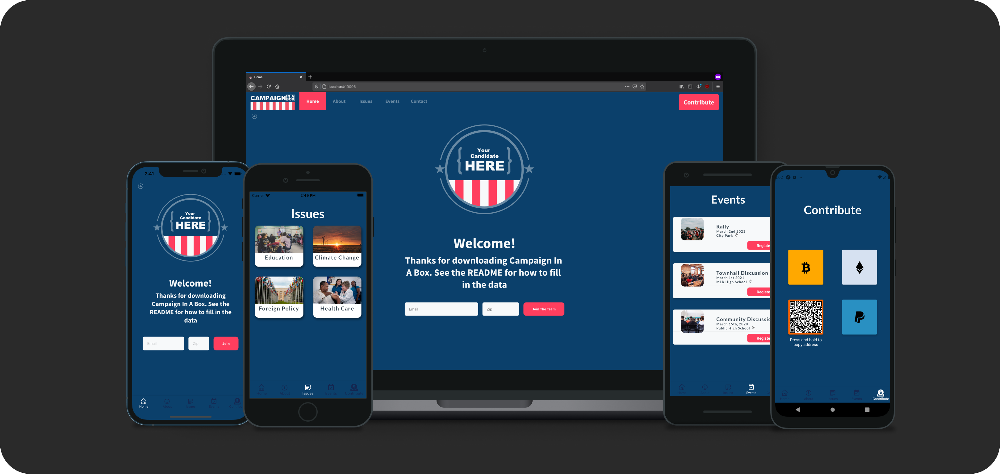

# Campaign In A Box



Campaign In A Box ready to deploy app template intended for bootstrapped political campaigns to spin up a campaign website that works on ios, android, and the web! I want to provide campaigns with modest budgets an easy way to get their ideas and message out there. With a little bit of Javascript knowledge and an AWS account, political hopefuls can keep their supporters up to date on upcoming events, and their vision for the direction of the country, all from a single codebase. 

This is app is built with [Expo](https://docs.expo.io/) and [React Native](https://reactnative.dev/).

## Features

💻 Ready to deploy Serverless backend. 

🌈 Theme-able

📈 GraphQL

👩🏽‍💻 Cross Platform (Web and Mobile!)

📖 Written in Typescript

## Deploy the back end and run the app

---

1. Clone the repo, install dependencies.

    ```bash
    ~ git clone https://github.com/jackburrus/Campaign-In-A-Box.git

    ~ cd Campaign-In-A-Box

    ~ yarn
    ```

2. Initialize and deploy Amplify Project.

    ```bash
    ~ amplify init

    ? Enter a name for the environment: dev (or whatever you would like to call this env)
    ? Choose your default editor: <YOUR_EDITOR_OF_CHOICE>
    ? Do you want to use an AWS profile? Y

    ~ amplify push

    ? Are you sure you want to continue? Y
    ? Do you want to generate code for your newly created GraphQL API? Y
    ```

3. Start the app.

    ```bash
    ~ expo start
    ```
    
4. Press 'i' to run on ios, 'a' to run on android, and 'w' to run on the web!

## Filling in the data

1. Unchanging data, such as the candidates contact information, welcome message, or logo can be updated in the `APP_DATA.ts` file and auto populates across your app.

## Populate database

---

1. Open the AppSync console.

    ```bash
    ~ amplify console api
    ```

2. Create a new issue with the following GraphQL mutation:

    ```graphql
    mutation issueICareAbout {
      createIssue(input: 
        {
        category: "Health Care",
        image: "https://images.unsplash.com/photo-1576765607924-3f7b8410a787?ixid=MXwxMjA3fDB8MHxwaG90by1wYWdlfHx8fGVufDB8fHw%3D&ixlib=rb-1.2.1&auto=format&fit=crop&w=2254&q=80",
        position: "My candidate believes quality healthcare is a human right.",
        tags: ["AffordableCareAct", "HumanRight", "AffordableOptions"],
        detailedPosition: "My candidate believes that every American has a right to the peace of mind that comes with knowing they have access to affordable, quality health care."
        }) 
        {
        id
        image
        position
        tags
        detailedPosition
        category
        }
    }
    ```

3. Create a new event with the following GraphQL mutation:

    ```graphql
    mutation MyAwesomeEvent {
      createEvent(input: 
        {
        eventName: "Community Discussion", 
        date: "March 15th, 2020", 
        image: "https://images.unsplash.com/photo-1570616969692-54d6ba3d0397?ixid=MXwxMjA3fDB8MHxwaG90by1wYWdlfHx8fGVufDB8fHw%3D&ixlib=rb-1.2.1&auto=format&fit=crop&w=2209&q=80", 
        location: "Public High School"
        }) 
    	{
        id
        image
        location
        eventName
        }
    }
    ```

## To customize with your theme.

---

This app uses [Restyle](https://github.com/Shopify/restyle) for its styles and theme customization. You can find the file under `src/theme/Theme`

## Customization

---

Change the schema under `amplify/backend/api/{YOUR_APP_NAME}/schema.graphql`

Redeploy to Amplify

```bash
~ amplify push
```

## Contributing

---

If you like this idea and want to contribute to the code, i'd be happy to review pull requests. I want to make sure this project is always easy and cheap to run, so campaigns with modest budgets can always have access. If you have ideas on how to achieve this goal, i'd love to hear them!